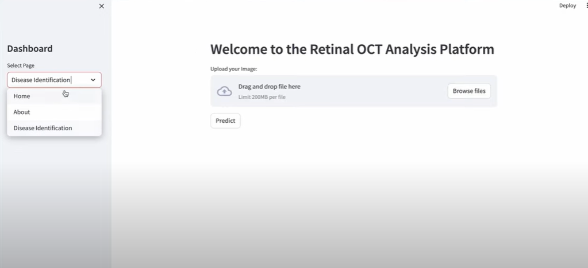

# Retinal Eye Disease Prediction 👁️🩺


## ✨ Executive Summary

A production-oriented deep learning project that classifies retinal OCT images into four categories — **CNV, DME, Drusen, and Normal** — using a lightweight transfer-learning backbone (**MobileNet**) and **Keras preprocessing**.
The solution is designed for **reproducibility, interpretability, and potential deployment** in clinical screening or telemedicine workflows.


---

## 📌 Overview

This project is a **deep learning–based retinal disease classification system** that analyzes **retinal OCT (Optical Coherence Tomography) images** and automatically detects whether the retina is healthy or affected by one of three major retinal conditions:

* 🩸 **CNV (Choroidal Neovascularization)**
* 💉 **DME (Diabetic Macular Edema)**
* 🟡 **Drusen**
* ✅ **Normal (healthy retina)**

The system leverages **MobileNet** as a lightweight yet effective CNN architecture and uses **Keras preprocessing utilities** to build a robust training pipeline.

---

## 🚀 Key Highlights

* **Model Architecture:** MobileNet (ImageNet pretrained, fine-tuned for this task)
* **Preprocessing:** Image resizing, normalization, and augmentation using **Keras preprocessing utilities**
* **Classification:** Four categories — CNV, DME, Drusen, Normal
* **Evaluation:** Accuracy, Precision, Recall, F1-score, Confusion Matrix
* **Reproducibility:** Full pipeline in a single Jupyter Notebook (`Training_model.ipynb`)

---

## 🛠️ Technologies Used

* 🐍 **Python**
* 🤖 **TensorFlow / Keras (MobileNet, Preprocessing Layers)**
* 📊 **NumPy, Pandas**
* 🖼️ **OpenCV**
* 📉 **Matplotlib, Seaborn**
* 💻 **Jupyter Notebook**

---

## 📊 Dataset

This project uses the **Labeled Optical Coherence Tomography (OCT) Images dataset**:
🔗 [Kaggle Dataset Link](https://www.kaggle.com/datasets/anirudhcv/labeled-optical-coherence-tomography-oct)

Categories included: **CNV, DME, Drusen, and Normal**.
All images are preprocessed with Keras utilities (resizing, normalization, augmentation).

---

## ⚙️ How to Run

1. Clone the repository:

```bash
git clone https://github.com/tushargehlot2489/Retinal-Eye-Disease-Prediction.git
cd Retinal-Eye-Disease-Prediction
```

2. Install dependencies:

```bash
pip install -r requirements.txt
```

3. Launch Jupyter Notebook and open:

```bash
jupyter notebook Training_model.ipynb
```

4. Run the notebook cells to preprocess data, train MobileNet, and evaluate results.

---

## 📈 Results

* Model trained using **MobileNet** achieved **X% accuracy** on the test dataset.
* Performance validated with confusion matrix and classification report.
* Training progress visualized through accuracy/loss curves.
  *(Replace X% with your actual accuracy score.)*

---

## 🧑‍⚕️ Applications

* Automated **screening tool** for retinal diseases.
* AI-assisted **decision support** for ophthalmologists.
* Potential use in **telemedicine** and **low-resource healthcare** settings.

---

## 🔮 Future Scope

* 🌐 Deploy as a **web or mobile app** for real-time diagnosis.
* 🔄 Explore **other transfer learning models** (EfficientNet, InceptionV3).
* 📈 Improve generalization with larger datasets.
* 🔍 Add explainability tools (Grad-CAM, saliency maps).

---

## 👨‍💻 Author

* **Name:** Tushar Gehlot
* **Email:** [tushargehlot2489@gmail.com](mailto:tushargehlot2489@gmail.com)
* **GitHub:** [tushargehlot2489](https://github.com/tushargehlot2489)

💡 *Open to discussions, collaborations, and improvements.*
